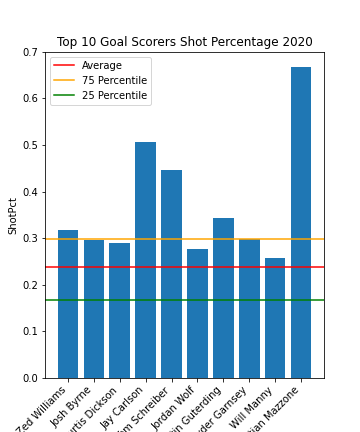

# Final Project 

## Objective
My objective is to filter and transform this data to see if there is a correlation between more shots and shots on goal 
leading to more goals or if the top goal scorers in the league have higher shooting percentages making them more efficient 
shooters. 

## Hypothesis
My hypothesis is that the best shooters in the PLL are going to also lead the league in shots and I belief that they will be close to the top in shooting percentage as well. This goes for both shots and shots on goal. It makes sense for the best players to take the most shots, but this can also lead to them taking more contested and low percentage shots that can affect their shooting percentages. I also believe that the league leaders in shots and shots on goal will be mostly attackman and I also think that their shooting percentages will be better than Midfielders because they tend to shoot more close range shots increasing their probability to score. Midfielders tend to shoot more from range and on the run which can affect their success rate.

## Approach Using Pandas
After learning Pandas in class, I was able to create a dataframe that filtered the data to show only players names, goals, shots, shotpct, shotsongoal, shotsongoalpct. I also limited it to only show these columns for players who's positions are attack and midfield, and limited it to one season. There are three seasons in this dataset, so I plan on using all three years as three different cases of my analysis.I limited the season segment to the regular season. I did this to try to minimize the games played differences. Teams that go farther in the playoffs lay more games and players shoot and score more. Even though players could miss regular season games to injuries I feel that limiting games to just regular season this will make my analysis more accurate and helps limit outliers. 

My goal is to see if the leading goal scorers in the PLL shoot more than other players meaning that they also lead the league in shots and shots on goal or are the most effecient shooters, meaning that their shooting percentages are higher than other players. I feel that the top scorers will also be towards the top in shots taken, but I can also see that some of the top goal scorers pick and choose their shots better and are able to score on a higher percentage of their shots. 

I chose to limit my analysis to only attack and midfielders because these are offensive players. Other positions like defensemen and defensive middies could have goals and shots, but I felt that they may skew the data and would have small sample sizes. I wanted to focus on guys who main role is to contribute to the offense and have a shooting skillset. I also put a conditon in to only include players who had at least a shot. It made no sense to include players who may have played in a game or games in the season but did not register a shot. I chose by season because this gives me three different trials to see if results are consistent over multiple seasons with a few different players every year. Also, it is common to judge players performance on season base and allows for a more condensed analysis versus on a game basis. 

## Analysis
To start my analysis I used pandas to make dataframes that condensed my csv file from showing player stats for every game to every season. From this I was able to create a scatter plot graphs that showed each player from each year and how the number of goals compared with the number of shots, shots on goal, shooting percentage, and shots on goal percentage. Then I compared the top 10 goal scorers to my datasets average numbers. Lastly I compared the attack and midfield position by taking their average numbers from players listed as each position.

#### By Player Stat Graphs
Using these three dataframes I can conduct my analysis. I then made graphs that compared goals to Shots, ShotsPct, ShotsOnGoal, and ShotsOnGoalPct. These are good starting graphs for my analysis. You can see that the Goals vs Shots and Goals vs ShotsOnGoal graphs are very linear in the positive direction, while the Goals vs ShotPct and Goals vs ShotsOnGoalPct are more logarithmic looking. This is consistent through all three years. The goal and shot numbers in the year 2020 are lower than 2019 and 2021 because that was a shortened season due to covid, but the shooting percentages are consistent with the other two years.

#### Top 10 Goal Scorer vs Rest of the League
My next group of graphs compare the top 10 goal scorers to my datasets average. I plotted the 10 players as a bar graph and added the 25 percentile, average, and 75 percentile. I did this for shots, shot percentage, shots on goal and shot on goal percentage. Looking at the Top 10 Goal Scorers Shots 2021 graph 9/10 of the players are over the 75 percentile and all of them are well over the average. In the 2020 graph 8/10 players are over the 75th percentile while 1 is just below the 75th percentile and 1 is just above the 25 percentile. This is a clear outlier. This can be explained, 2020 was the shortend season where teams played 4-8 games so the goal and shot numbers were not as high as the other seasons, you can see in the graph the large drop off at Christian Mazzone. He was 10th on the goal list and 10th in shots for the top 10 goal scorers, which correlates perfectly. The 2019 graph follows the same pattern as the 2021 graph. 9/10 are above the 75 percentile and one is in the middle of the 75 and average. Over this data shows that the top goal scorers in the PLL also tend to lead the league in shots taken. 

Looking at the Top 10 Goal Scorers Shot Percentage for the three different seasons in every year there is one to two outliers in the data that are far above the other top 10 players and the 75 percentile. In all three years all the top 10 are above the average. The league average sits around 22%-25% each year adn looking at the top 10 they range from 26%-69%. This is a very large margin and shows how diferent players score goals in different ways. The players with the crazy high percentages like Eric Law in 2019 and Christian Mazzone in 2020 are crease attackman who most of their shots come from finishing in close around the net. This goes back to my hypothesis that attackman will most likely have higher shooting percentages than midfielders because of players like this who are very good at finishing in close to the net. Looking at the top 10 goal scorers over the three years only 5/30 are midfielders. Either way based on this analysis the top goal scorers in the PLL are also in the higher percentage of shooting percentage, but it is not as large of a gap as in the shots category. In shooting percentage there are the one or two outliers that are far above the rest of the league, but there is also the league goal leaders who shoot close to the league average and just take more shots. 

For the Shots on Goal comparison, it follows a similar trend as the shots chart. There were only two players in the top 10 for goal scoring over three seasons that were below the 75th percentile and one under the 50th percentile. These players were also on the lower side for total shots taken in the previous graphs. It makes sense that the players with the most shots on goal will also score the most. There could be guys who are towards the top of the league in shots, but their shots on goal are not and this definely affects their shooting percentage. Not putting shots on frame does not give you a chance to score. Putting a shot on a 6X6 goal going against a goalie, your chances to score are decent. Especially when most shots taken in lacrosse are within 15 yards and guys in the PLL can shoot 100MPH. The top 10 goal scorers appear to be in a higher percentile than in the shots chart. This means that the players who can put their shots on cage improve their scoring rates. 

The Shots on Goal Percentage numbers for the top 10 goal scorers in the PLL are closer to the rest of the field of players more than any other statistic we have looked at. There are 11 players in the top 10 over the three seasons that are under the 75th percentile in this category. However there are none below the league average. This means that the top scorers are not putting their shots on goal at such a higher rate than the rest fo the league, but they take more shots and score on a higher percentage of their shots that do go on net. There are a few of the top 10 in each year that do have very high percentages, the highest being over 70%. I was expecting a few more of the top 10 players to have numbers like this. In a game like lacrosse, especially in the fast-paced PLL, the goalies are not set up to succeed as much as the shooters are. I was expecting that all of the top 10 players would have very high shot on goal percentages compared to the rest of the league, but the variation in this data shows the different types of players and the different types of goal scorers. THere are guys who put most of their shots on net and therefore increase their chances of scoring and their are guys who miss the net more but when they do hit the net, the ball tends to go in. 

#### Attack vs Midfielders
My last analysis was to compare attack and midfielders to see which position can be considered better shooters. For reference, there are 3 attackman and 3 midfielders on the field for an offensive position. Attackman stay on the field the entire game, but cannot cross the midfield line to go on defense. Midfielders can go all over the field and get subbed on and off throughout the game. The midfielders in this case are considered offensive midfielders which means that they are subbed on for offensive possessions and tend to sub off when their teams goes on defense. 

I made two graphs for each year. I made a graph that compared the average goals, shots, and shots on goal for attackmen and midfielders and a graph that compares the average shooting percentage and shots on goal percentage for each position. The results show that the attack average is higher in every statistical analysis for each year. In all 3 years, the goal average amongst attackman was almost double midfielders and attackmen ranged 8-10 more shots and 5.8-8.9 more shots on goal in each year. I expected attackman to lead in these categories, but not by this much. Midfielders tend to be more shooters, while attackmen usually are more balanced between feeding and shooting. However, because attackmen are on the field at all times they benefit from fast breaks and broken plays, where offensive middies may not be on the field. I was suprised the numbers were this skewed towards attackman, this shows how valuable having good attackmen is to a successful offense. Looking at the shooting percentages and shots on goal percentages again attackmen lead in each year by a largee margin. Attackman led by 7%-9% in shooting percentage and 9%-11% in shots on goal percentage in each year. This is a very large gap for lacrosse shooting percentages. The numbers are relatively consistent over the 3 years with attackmen in the 26%-27% range for shooting percentage and 39% every year for shots on goal percentage. Midfielders on the other hand are between 18%-20% for shooting percentage and 28%-30% range for shots on goal percentage. This shows that midfielders are not as efficient shooters as attackman. This is as I predicted becasue midfielders tend to shoot from farther out and on the run more, whereas attackman tend to shoot from a closer range and alot from in tight. 

#### Conclusion
After this analysis, my conclusion is that there is a correlation between the number of shots and goals scored as well as a higher shooting percentage and goals. By looking at every player individually, comparing the top scorers vs the rest of the league, and comparing the attack position to the midfield position I was able to take a look at this data from multiple angles and the results were very consistent. Attack having higher shot and shooting percentage averages than midfielders explains why the top 10 goal scorers are prodominatly attackman. Overall, each player has their own sytle of play and way of scoring and while some of the variation can be explained by their positions and skillsets, some of these numbers cannot be explained without watching the games. I can see why in sports there is a divide amongst coaches and players with analytics. Analytics can help make decisions based on numbers and statistics over history, but there are factors in sports like momentum and emotion that cannot be measured by data yet. 
